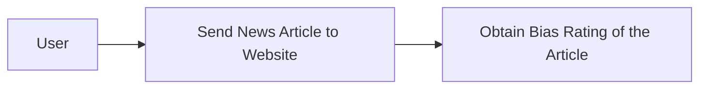
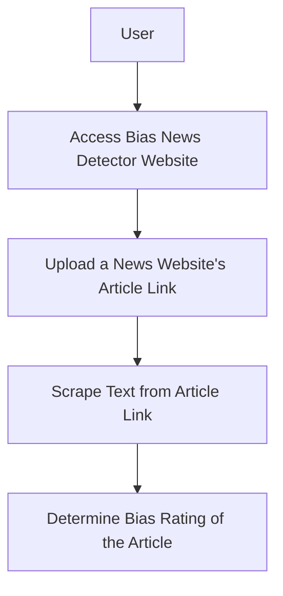
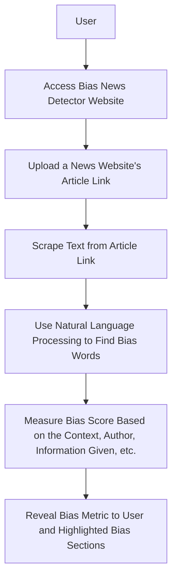

# Senior_Capstone

## Team Name
JTCX

## Team Memebers
### Jordan Shaheen
- Major: Computer Science
- Email Address: shaheejn@mail.uc.edu
### Cole Hutchins
- Major: Computer Science
- Email Address: hutchicj@mail.uc.edu
### Toby Knueven
- Major: Computer Science
- Email Address: knueveta@mail.uc.edu
### Xander Hatton
- Major: Computer Science
- Email Address:
### Dr. William Hawkins III
- Advisor
- hawkinwh@ucmail.uc.edu

## Project Description
Modern readers of online political content are often just looking for the facts so that they can form their own opinions. Unfortunately, many news sources and articles are biased to one side or the other in their reporting, which can make up readers’ minds for them. For readers who don’t have the time to investigate every author, source, and claim, our tool will provide a simple bias score for any online news article. Readers will then be able to make informed decisions about which articles they choose to read and check other sources if they wish.

## User Stories and Design Diagrams

### User Stories
- As a person reading the news, I want to understand the bias of articles I read in order to come to my own understanding of topics I am interested in.
- As a Polysci student, I want a bias-metric to understand the mathmatical measurement of the bias in order to research more effectively.
- As a marketing professional, I want to understand the bias in news articles to help advertise correctly to the right audiences.

### Design Diagrams
### Design Level 0

### Design Level 1

### Design Level 2

## Project Tasks and Timeline
### Task List
- Create a formalized outline of webpage mapping and universal styling for all webpages
- Create webscraper that analyizes the news article website URL and scrapes the article text accuratly
- Create Machine Learning Natural Language Processing feature that can correctly detect bias in the scraped news article
- Create bias metric with Machine Learning to understand how bias or unbias the news article is and present the metric intuitivly to user.

### Timeline
| Task | Start Date | Planned Completion Date |
|------|------------|-----------------|
| Task 1: Webpage outline | 01/08/2024 | 01/22/2024 |
| Task 2: Webscraper | 01/22/2024 | 02/05/2024 |
| Task 3: Bias metric/training data | 02/05/2024 | 02/19/2024 |
| Task 4: ML NLP bias classifier | 02/19/2024 | 03/18/2024 |

### Effort Matrix
| Task Description | Team Member of Primary Responsibility | Shaheen Effort (%) | Hatton Effort (%) | Knueven Effort (%) | Hutchins Effort (%) |
|------------------|---------------------------------------|---------------------|---------------------|---------------------|---------------------|
| Task 1: Webpage outline | Jordan Shaheen                 | 75%                 | 25%                 | 0%                  | 0%                  |
| Task 2: Webscraper | Alexander Hatton                    | 25%                 | 75%                 | 0%                  | 0%                  |
| Task 3: Bias metric/training data  | Tobias Knueven      | 0%                  | 0%                  | 75%                 | 25%                 |
| Task 4: ML NLP bias classifier  | Colson Hutchins        | 0%                  | 0%                  | 25%                 | 75%                 |

## ABET Concerns Essay

## Slideshow
https://docs.google.com/presentation/d/1co4_NATWwx58o8fNLTBt8JRdHQASSN4Hl-MjrWZ7DQw/edit?usp=sharing

## Self-Assessment Essays

## Professional Biographies

## Budget
There have been no expenses to date.

## Appendix
https://medium.com/@danilo.najkov/detecting-political-bias-in-online-articles-using-nlp-and-classification-models-c1a40ec3989b
