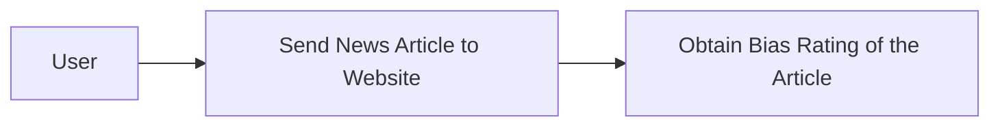
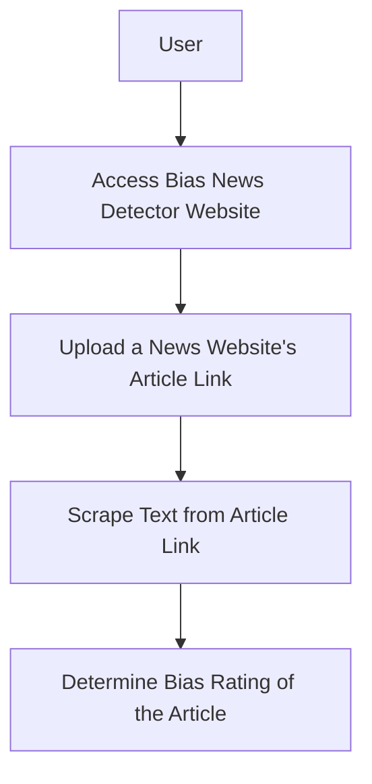
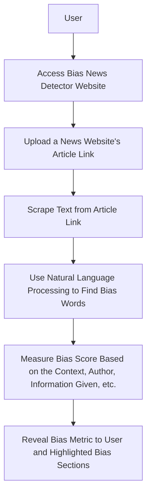

# Senior_Capstone

### Team Name
JTCX

### Team Memebers
Jordan Shaheen
- Major: Computer Science
- Email Address: shaheejn@mail.uc.edu

Cole Hutchins
- Major: Computer Science
- Email Address: hutchicj@mail.uc.edu

Toby Knueven
- Major: Computer Science
- Email Address: knueveta@mail.uc.edu

Xander Hatton
- Major: Computer Science
- Email Address: hattonab@mail.uc.edu

Dr. William Hawkins III
- Advisor
- hawkinwh@ucmail.uc.edu

### [Project Abstract](docs/Abstract_Description.md)
The News Bias Detector aims to promote media literacy by analyzing online news for bias. Utilizing advanced NLP and ML techniques, it scrutinizes text for language patterns indicating bias. This project, driven by the escalating concerns around misinformation, leverages Django for web development and Python for algorithmic analysis. Key features include URL input for scraping articles and real-time bias assessment. Development is informed by extensive research into bias detection methodologies, existing tools, and user interaction paradigms, ensuring a blend of technical proficiency and user-centric design. This tool aspires to be an essential aid for discerning readers in the digital age.

### User Stories
- As a person reading the news, I want to understand the bias of articles I read in order to come to my own understanding of topics I am interested in.
- As a Polysci student, I want a bias-metric to understand the mathmatical measurement of the bias in order to research more effectively.
- As a marketing professional, I want to understand the bias in news articles to help advertise correctly to the right audiences.

### Design Diagrams
Design Level 0

Design Level 1

Design Level 2

### Project Task List
- Create a formalized outline of webpage mapping and universal styling for all webpages
- Create webscraper that analyizes the news article website URL and scrapes the article text accuratly
- Create Machine Learning Natural Language Processing feature that can correctly detect bias in the scraped news article
- Create bias metric with Machine Learning to understand how bias or unbias the news article is and present the metric intuitivly to user.

### Project Timeline
| Task | Start Date | Planned Completion Date |
|------|------------|-----------------|
| Task 1: Webpage outline | 01/08/2024 | 01/22/2024 |
| Task 2: Webscraper | 01/22/2024 | 02/05/2024 |
| Task 3: Bias metric/training data | 02/05/2024 | 02/19/2024 |
| Task 4: ML NLP bias classifier | 02/19/2024 | 03/18/2024 |

### Effort Matrix
| Task Description | Team Member of Primary Responsibility | Shaheen Effort (%) | Hatton Effort (%) | Knueven Effort (%) | Hutchins Effort (%) |
|------------------|---------------------------------------|---------------------|---------------------|---------------------|---------------------|
| Task 1: Webpage outline | Jordan Shaheen                 | 75%                 | 25%                 | 0%                  | 0%                  |
| Task 2: Webscraper | Alexander Hatton                    | 25%                 | 75%                 | 0%                  | 0%                  |
| Task 3: Bias metric/training data  | Tobias Knueven      | 0%                  | 0%                  | 75%                 | 25%                 |
| Task 4: ML NLP bias classifier  | Colson Hutchins        | 0%                  | 0%                  | 25%                 | 75%                 |

### ABET Concerns Essay
The development and deployment of our news bias detector are influenced by multiple economic, ethical, security, and social constraints. Economically, our project relies heavily on open-source software and publicly available tools due to the short time for development, and our team has no budget for the project. These circumstances may limit the range of features we can offer and the quality of our bias detection. Professionally, this project aims to bolster the reputation of an unbiased, factual news distribution. From an ethical standpoint, our detector's potential influence on a user's perception of news presents a significant challenge. Our tool mustn't inadvertently promote a particular narrative or suppress another, ensuring its impact remains neutral. Security concerns also arise, mainly related to user data privacy. Since users will submit news article URLs for analysis, measures to prevent data breaches and ensure the anonymity of user submissions are paramount. Socially, the news bias detector is intended to serve the broader public by promoting informed citizenship. By helping users discern biases in news, we aspire to enhance the quality of public discourse. Environmental and cultural constraints are less predominant in our project; however, our design is focused on accessibility, ensuring diverse user groups, irrespective of language or background, can benefit from our tool.

### [Slideshow](docs/Slide_Deck.pptx)
https://docs.google.com/presentation/d/1co4_NATWwx58o8fNLTBt8JRdHQASSN4Hl-MjrWZ7DQw/

### Self-Assessment Essays

**Tobias Knueven**

Bias in news reporting is becoming more recognizable, and many individuals have a desire to explore multiple sides of an issue before forming their own opinion. The goal of our senior design project is to create a browser extension that analyzes the text of an article and gives a political bias score on a left-right scale, so that users can search out neutral sources of news or at least read both left- and right-biased news. We will train an AI model on existing news articles to detect political bias. Users will be able to use the browser extension on any webpage to generate a left-right bias score. We hope that this tool will provide more transparency about information online and allow users to explore multiple perspectives.

The courses I have taken at the University of Cincinnati have provided me with relevant experience for the development of this project. Particularly useful experience for this project are EECE-5136, Intelligent Systems, and CS-5173, Deep Learning. In Intelligent Systems, I learned how to build and train various types of neural networks from scratch. This has given me a better understanding of how machine learning works behind the scenes, which will help me when I build a training dataset for detecting bias. In Deep Learning, I learned how to use state-of-the-art tools for deep learning in various use cases. This will help me work with a team to develop a supervised learning model to detect bias.

My co-op work has also provided me with relevant experience. In particular, my web development work with Siemens and my embedded development work with Mercedes-Benz will be helpful for this project. At Siemens, I worked extensively with both front-end and back-end development. This experience will apply to developing a browser extension, because I now have a stronger understanding of how websites work. At Mercedes, I spent a lot of time troubleshooting difficult problems and improving code performance. This has prepared me to help my team debug code when unexpected problems arise and improve any performance issues.

I am excited to work on this project because of the increasing relevance of AI technology and the real challenge bias in news reporting provides. I was in high school when the 2016 election polarized the political discourse in both media and social settings. Ever since then, I have had a heightened awareness of the negative effects of bias in online media. That’s why I’m looking forward to creating a software solution that will help people become more aware of the biases in the media they read. If people begin to read news sources with varying opinions, they will have an easier time developing an opinion of their own. And any tool that allows citizens to more actively participate in their political system provides immeasurable social value.

My preliminary approach to such a project would be to develop a supervised learning model. We would collect contemporary news articles from a variety of sources, some with a stronger left bias, some with a stronger right bias, and some with minimal bias. We would give each individual article a numerical left-right bias score, -1 being strong left bias and 1 being strong right bias. We would train the model until we achieve the expected result of reliable scores on articles the model has never seen. With a functional model in place, we would build a front-end browser extension to extract the article heading and body text and send them to our model for scoring. We would hope that our model can reliably score articles from a variety of sources and that the browser extension would be easy to use.

**Jordan Shaheen**

The goal for my senior year capstone is to showcase my current potential as a computer scientist and what I have learned throughout my experience in college.
When deciding on my capstone project, my team and I chose a topic and software techniques prevalent today.
A successful Computer Science capstone creates a meaningful software application that is original, challenging, and cutting-edge.
Therefore, with the help of my teammates and I, we have come up with the idea of creating a Bias News Detector.
Theoretically, we could have attempted to create a less complicated project that we thought would be easier to finish and get a good grade smoothly.
However, we decided to go as far as our skills could take us to create something we truly wanted to develop.

For this project, my college curriculum has given me an excellent foundation to tackle it.
I have gained a great sense of team collaboration in all the group assignments and projects I have completed throughout my college career.
Recently, my and I have had meetings about our project, and there is a healthy amount of camaraderie that can help us collaborate on this project even more effortless.
Also, my past enrollments in Software Engineering (EECE3093C), a class built around developing a software application with your group, gave me a great sense of what this project would be like.
For that class, my group and I created a web-based application that uses Google Maps API to find the quickest routes between buildings on UC’s campus.
Furthermore, my past enrollment in AI: Principles and Applications (CS4033) and my current enrollment in Machine Learning (CS5137) will help me quickly grasp this project's natural language processing aspect of our Bias News Detector.
My team and I can make this project successful with my past experiences creating a web-based application, having a good overall understanding of ML/AI, and having healthy team collaboration.

Along with my college curriculum, my co-op experiences will become very beneficial throughout this project.
All three of my co-ops fall under the job title of Web Developer for a startup company named Remarcable.
Specifically, using Python’s web framework, Django, I managed a website, added admin functions, created API webhooks, adjusted and created HTML templates, webscrape functions, an Optical Character Recognition application, moved the website into Docker containers, etc.
With my co-op experiences, I now have above-average knowledge of creating web-based applications with Django.
On the contrary to having a lot of team collaboration within my college curriculum experiences, the projects I have worked on within my co-ops have been strictly independent.
Working solo throughout my co-op experiences has increased my reliability as a software engineer.

Based on the meetings my team and I have carried out, we have a solid preliminary project approach.
First, our website framework will be Django, which will dictate the backend and frontend structure of our website's construction.
As for finding out if a news article is biased, we will mainly use Natural Language Processing.
Although, to read these articles in the first place, we have yet to decide on creating an optical character recognition feature or giving the text to an API that could decipher the text for us.
With natural language processing, it can read the news articles allocated to the machine. Then, it will be able to find target words with bias associated with them.
With the target words, we will have a point system that categorizes biased comments based on their severity and generates an outcome stating whether the news article is biased.
If so, we will highlight where precisely the news article is biased.
If we have enough time left over for this project, we will then try and create the same bias detector for news videos.
The process of this Bias News Detector is still being brainstormed; there may still be some complications about the project structure that we currently can’t foresee and are subject to change.
However, my team and I will know the project is done when we have an accurate software application that detects bias in news and has an intuitive and user-friendly user interface.

With all my experience with web-based applications and our project topic being prevalent today, I am very motivated to work on this capstone.
I am motivated by this project because it will use new software techniques within the AI/ML field that I have yet to be able to use before.
To determine our progress this year, we will keep track of our contributions within our GitHub Repository’s commits to the main branch to see how motivated my team and I are.
Suppose my team and I have steady commits to the repository throughout this capstone project and are consistent with meetings and communications. In that case, I believe that we will be able to finish this project efficiently.
Also, with the commit data in the project’s GitHub Repository, we could see if we tried our best for this project and if we did as much as we could throughout this course.

## Professional Biographies

### Tobias Knueven

**Co-op experience**
- Software Development Intern, Mercedes-Benz Group AG, Sindelfingen, Germany (2 semesters):
    - Worked with an embedded development team on map fusion project for the infotainment display
    - Conceptualized and detailed fusion algorithms
    - Implemented the algorithms for use in production vehicles
    - Tested the results and expanded the concepts accordingly
    - Developed and documented performance-focused C++ code
- Web Development Intern, Siemens Digital Industries Software, Milford, OH (1 semester):
    - Worked with a full-stack development team on an internal tool
    - Took ownership of making styling changes on five embedded pages to improve UI
    - Developed REST services for a new bulk delete feature
    - Conducted manual QA testing before release
    - Developed both AngularJS frontend and Java backend
- Machine Learning Research Intern, University of Cincinnati, Cincinnati, OH (1 semester):
    - Experimented with existing subspace clustering algorithms for high-dimensional time series data
    - Compared subspace clustering with a new experimental algorithm using correlation networks
    - Developed visualizations of the clustering results on datasets like fMRI
    - Used Python and Julia in Jupyter Notebooks to test the algorithms and generate visuals

**Skills/Expertise**
- Programming: C++, Java, Python, Julia
- Operating Systems: Linux, Windows
- Web Development: HTML/CSS, AngularJS
- Database Querying: SQL

**Areas of interest**
- Automotive Industry
- Artificial Intelligence

### Jordan Shaheen

**Co-op Experience**

**Remarcable | Website Development (January 2021 – June 2021)**
- Enhanced Southwire’s Industrial website functionality.
- Solo work with Django for HTML template adjustments, database creation, patch fixes, product illustration, and Django admin functions.
- Developed admin functions for dimensional and electrical calculations based on product specifications.
- Displayed data on product detail webpages.
- **Website:** [industrial.southwire.com](http://industrial.southwire.com)
- **Software:** Python, HTML, CSS

**Remarcable | Webscrape Application (June 2021 – August 2021)**
- Developed a Django webscrape admin function.
- Parsed dimensional cable data from a private Southwire website.
- Application accessed through Southwire VPN, using BeautifulSoup for parsing.
- **Software:** Python

**Remarcable | Optical Character Recognition Application (June 2022 – August 2022)**
- Developed an Optical Character Recognition application in a team.
- Parsed data from Invoice, Quote, and Sales Order PDFs.
- Transferred data to multiple databases using APIs.
- Used Django, Tesseract, OpenCV, and Camelot for backend.
- Frontend development with Angular10 and Angular Material.
- Application in beta stage upon exit from Co-op.
- **Software:** Python, HTML, CSS, Angular10, Angular Material, TypeScript

**Programming Language Experience**
- C++
- Java
- CSS
- HTML
- TypeScript
- Python
- Angular10
- Angular Material

**Skills**
- Django Web Development with Angular10
- Website Scraping
- Optical Character Recognition
- Image Transforming with OpenCV
- Creating Webhooks

## Budget
There have been no expenses to date.

## Appendix
Machine Learning
- https://medium.com/@danilo.najkov/detecting-political-bias-in-online-articles-using-nlp-and-classification-models-c1a40ec3989b

Web Scraping
- https://github.com/wention/BeautifulSoup4
- https://github.com/codelucas/newspaper
- https://github.com/miso-belica/jusText
