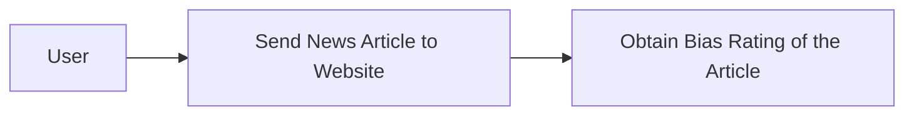
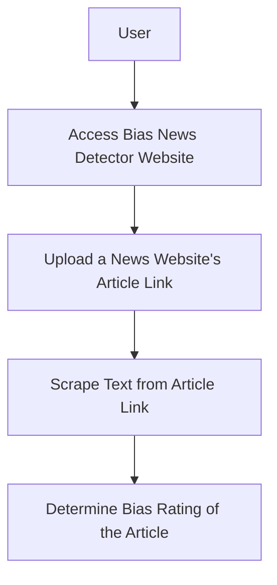
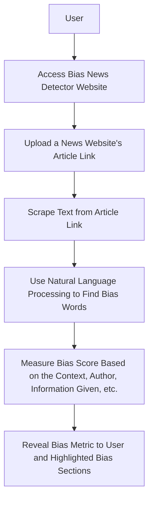

# Senior_Capstone

### Team Name
JTCX

### Team Memebers
Jordan Shaheen
- Major: Computer Science
- Email Address: shaheejn@mail.uc.edu

Cole Hutchins
- Major: Computer Science
- Email Address: hutchicj@mail.uc.edu

Toby Knueven
- Major: Computer Science
- Email Address: knueveta@mail.uc.edu

Xander Hatton
- Major: Computer Science
- Email Address:

Dr. William Hawkins III
- Advisor
- hawkinwh@ucmail.uc.edu

### Project Abstract [Abstract](docs/Abstract_Description.md)
The News Bias Detector aims to promote media literacy by analyzing online news for bias. Utilizing advanced NLP and ML techniques, it scrutinizes text for language patterns indicating bias. This project, driven by the escalating concerns around misinformation, leverages Django for web development and Python for algorithmic analysis. Key features include URL input for scraping articles and real-time bias assessment. Development is informed by extensive research into bias detection methodologies, existing tools, and user interaction paradigms, ensuring a blend of technical proficiency and user-centric design. This tool aspires to be an essential aid for discerning readers in the digital age.

### User Stories
- As a person reading the news, I want to understand the bias of articles I read in order to come to my own understanding of topics I am interested in.
- As a Polysci student, I want a bias-metric to understand the mathmatical measurement of the bias in order to research more effectively.
- As a marketing professional, I want to understand the bias in news articles to help advertise correctly to the right audiences.

### Design Diagrams
Design Level 0

Design Level 1

Design Level 2

### Project Task List
- Create a formalized outline of webpage mapping and universal styling for all webpages
- Create webscraper that analyizes the news article website URL and scrapes the article text accuratly
- Create Machine Learning Natural Language Processing feature that can correctly detect bias in the scraped news article
- Create bias metric with Machine Learning to understand how bias or unbias the news article is and present the metric intuitivly to user.

### Project Timeline
| Task | Start Date | Planned Completion Date |
|------|------------|-----------------|
| Task 1: Webpage outline | 01/08/2024 | 01/22/2024 |
| Task 2: Webscraper | 01/22/2024 | 02/05/2024 |
| Task 3: Bias metric/training data | 02/05/2024 | 02/19/2024 |
| Task 4: ML NLP bias classifier | 02/19/2024 | 03/18/2024 |

### Effort Matrix
| Task Description | Team Member of Primary Responsibility | Shaheen Effort (%) | Hatton Effort (%) | Knueven Effort (%) | Hutchins Effort (%) |
|------------------|---------------------------------------|---------------------|---------------------|---------------------|---------------------|
| Task 1: Webpage outline | Jordan Shaheen                 | 75%                 | 25%                 | 0%                  | 0%                  |
| Task 2: Webscraper | Alexander Hatton                    | 25%                 | 75%                 | 0%                  | 0%                  |
| Task 3: Bias metric/training data  | Tobias Knueven      | 0%                  | 0%                  | 75%                 | 25%                 |
| Task 4: ML NLP bias classifier  | Colson Hutchins        | 0%                  | 0%                  | 25%                 | 75%                 |

### ABET Concerns Essay

### Slideshow
https://docs.google.com/presentation/d/1co4_NATWwx58o8fNLTBt8JRdHQASSN4Hl-MjrWZ7DQw/edit?usp=sharing

### Self-Assessment Essays

### Tobias Knueven
Bias in news reporting is becoming more recognizable, and many individuals have a desire to explore multiple sides of an issue before forming their own opinion. The goal of our senior design project is to create a browser extension that analyzes the text of an article and gives a political bias score on a left-right scale, so that users can search out neutral sources of news or at least read both left- and right-biased news. We will train an AI model on existing news articles to detect political bias. Users will be able to use the browser extension on any webpage to generate a left-right bias score. We hope that this tool will provide more transparency about information online and allow users to explore multiple perspectives.

The courses I have taken at the University of Cincinnati have provided me with relevant experience for the development of this project. Particularly useful experience for this project are EECE-5136, Intelligent Systems, and CS-5173, Deep Learning. In Intelligent Systems, I learned how to build and train various types of neural networks from scratch. This has given me a better understanding of how machine learning works behind the scenes, which will help me when I build a training dataset for detecting bias. In Deep Learning, I learned how to use state-of-the-art tools for deep learning in various use cases. This will help me work with a team to develop a supervised learning model to detect bias.

My co-op work has also provided me with relevant experience. In particular, my web development work with Siemens and my embedded development work with Mercedes-Benz will be helpful for this project. At Siemens, I worked extensively with both front-end and back-end development. This experience will apply to developing a browser extension, because I now have a stronger understanding of how websites work. At Mercedes, I spent a lot of time troubleshooting difficult problems and improving code performance. This has prepared me to help my team debug code when unexpected problems arise and improve any performance issues.

I am excited to work on this project because of the increasing relevance of AI technology and the real challenge bias in news reporting provides. I was in high school when the 2016 election polarized the political discourse in both media and social settings. Ever since then, I have had a heightened awareness of the negative effects of bias in online media. That’s why I’m looking forward to creating a software solution that will help people become more aware of the biases in the media they read. If people begin to read news sources with varying opinions, they will have an easier time developing an opinion of their own. And any tool that allows citizens to more actively participate in their political system provides immeasurable social value.

My preliminary approach to such a project would be to develop a supervised learning model. We would collect contemporary news articles from a variety of sources, some with a stronger left bias, some with a stronger right bias, and some with minimal bias. We would give each individual article a numerical left-right bias score, -1 being strong left bias and 1 being strong right bias. We would train the model until we achieve the expected result of reliable scores on articles the model has never seen. With a functional model in place, we would build a front-end browser extension to extract the article heading and body text and send them to our model for scoring. We would hope that our model can reliably score articles from a variety of sources and that the browser extension would be easy to use.

## Professional Biographies

### Tobias Knueven

**Co-op experience**
- Software Development Intern, Mercedes-Benz Group AG, Sindelfingen, Germany (2 semesters):
    - Worked with an embedded development team on map fusion project for the infotainment display
    - Conceptualized and detailed fusion algorithms
    - Implemented the algorithms for use in production vehicles
    - Tested the results and expanded the concepts accordingly
    - Developed and documented performance-focused C++ code
- Web Development Intern, Siemens Digital Industries Software, Milford, OH (1 semester):
    - Worked with a full-stack development team on an internal tool
    - Took ownership of making styling changes on five embedded pages to improve UI
    - Developed REST services for a new bulk delete feature
    - Conducted manual QA testing before release
    - Developed both AngularJS frontend and Java backend
- Machine Learning Research Intern, University of Cincinnati, Cincinnati, OH (1 semester):
    - Experimented with existing subspace clustering algorithms for high-dimensional time series data
    - Compared subspace clustering with a new experimental algorithm using correlation networks
    - Developed visualizations of the clustering results on datasets like fMRI
    - Used Python and Julia in Jupyter Notebooks to test the algorithms and generate visuals

**Skills/Expertise**
- Programming: C++, Java, Python, Julia
- Operating Systems: Linux, Windows
- Web Development: HTML/CSS, AngularJS
- Database Querying: SQL

**Areas of interest**
- Automotive Industry
- Artificial Intelligence

## Budget
There have been no expenses to date.

## Appendix
https://medium.com/@danilo.najkov/detecting-political-bias-in-online-articles-using-nlp-and-classification-models-c1a40ec3989b
