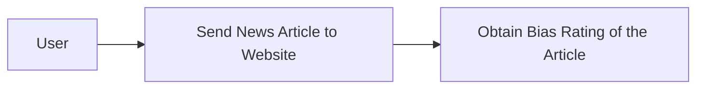
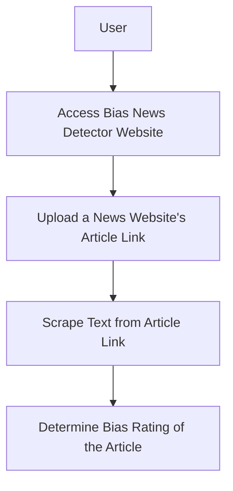
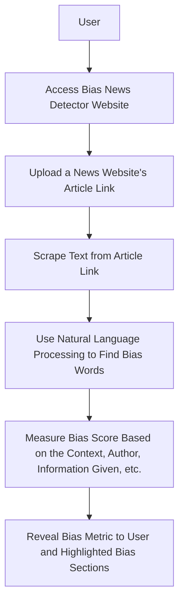

# Senior_Capstone

### Team Name
JTCX

### Team Memebers
Jordan Shaheen
- Major: Computer Science
- Email Address: shaheejn@mail.uc.edu

Cole Hutchins
- Major: Computer Science
- Email Address: hutchicj@mail.uc.edu

Toby Knueven
- Major: Computer Science
- Email Address: knueveta@mail.uc.edu

Xander Hatton
- Major: Computer Science
- Email Address: hattonab@mail.uc.edu

Dr. William Hawkins III
- Advisor
- hawkinwh@ucmail.uc.edu

### [Project Abstract](docs/Abstract_Description.md)
The News Bias Detector aims to promote media literacy by analyzing online news for bias. Utilizing advanced NLP and ML techniques, it scrutinizes text for language patterns indicating bias. This project, driven by the escalating concerns around misinformation, leverages Django for web development and Python for algorithmic analysis. Key features include URL input for scraping articles and real-time bias assessment. Development is informed by extensive research into bias detection methodologies, existing tools, and user interaction paradigms, ensuring a blend of technical proficiency and user-centric design. This tool aspires to be an essential aid for discerning readers in the digital age.

### User Stories
- As a person reading the news, I want to understand the bias of articles I read in order to come to my own understanding of topics I am interested in.
- As a Polysci student, I want a bias-metric to understand the mathmatical measurement of the bias in order to research more effectively.
- As a marketing professional, I want to understand the bias in news articles to help advertise correctly to the right audiences.

### Design Diagrams
Design Level 0

Design Level 1

Design Level 2

### Project Task List
- Create a formalized outline of webpage mapping and universal styling for all webpages
- Create webscraper that analyizes the news article website URL and scrapes the article text accuratly
- Create Machine Learning Natural Language Processing feature that can correctly detect bias in the scraped news article
- Create bias metric with Machine Learning to understand how bias or unbias the news article is and present the metric intuitivly to user.

### Project Timeline
| Task | Start Date | Planned Completion Date |
|------|------------|-----------------|
| Task 1: Webpage outline | 01/08/2024 | 01/22/2024 |
| Task 2: Webscraper | 01/22/2024 | 02/05/2024 |
| Task 3: Bias metric/training data | 02/05/2024 | 02/19/2024 |
| Task 4: ML NLP bias classifier | 02/19/2024 | 03/18/2024 |

### Effort Matrix
| Task Description | Team Member of Primary Responsibility | Shaheen Effort (%) | Hatton Effort (%) | Knueven Effort (%) | Hutchins Effort (%) |
|------------------|---------------------------------------|---------------------|---------------------|---------------------|---------------------|
| Task 1: Webpage outline | Jordan Shaheen                 | 75%                 | 25%                 | 0%                  | 0%                  |
| Task 2: Webscraper | Alexander Hatton                    | 25%                 | 75%                 | 0%                  | 0%                  |
| Task 3: Bias metric/training data  | Tobias Knueven      | 0%                  | 0%                  | 75%                 | 25%                 |
| Task 4: ML NLP bias classifier  | Colson Hutchins        | 0%                  | 0%                  | 25%                 | 75%                 |

### ABET Concerns Essay
The development and deployment of our news bias detector are influenced by multiple economic, ethical, security, and social constraints. Economically, our project relies heavily on open-source software and publicly available tools due to the short time for development, and our team has no budget for the project. These circumstances may limit the range of features we can offer and the quality of our bias detection. Professionally, this project aims to bolster the reputation of an unbiased, factual news distribution. From an ethical standpoint, our detector's potential influence on a user's perception of news presents a significant challenge. Our tool mustn't inadvertently promote a particular narrative or suppress another, ensuring its impact remains neutral. Security concerns also arise, mainly related to user data privacy. Since users will submit news article URLs for analysis, measures to prevent data breaches and ensure the anonymity of user submissions are paramount. Socially, the news bias detector is intended to serve the broader public by promoting informed citizenship. By helping users discern biases in news, we aspire to enhance the quality of public discourse. Environmental and cultural constraints are less predominant in our project; however, our design is focused on accessibility, ensuring diverse user groups, irrespective of language or background, can benefit from our tool.

### [Slideshow](docs/Slide_Deck.pptx)
https://docs.google.com/presentation/d/1co4_NATWwx58o8fNLTBt8JRdHQASSN4Hl-MjrWZ7DQw/

### Self-Assessment Essays

[Tobias Knueven](docs/Self_Assessment/Tobias_Knueven_Assessment.md)

[Jordan_Shaheen](docs/Self_Assessment/Jordan_Shaheen_Assessment.md)

## Professional Biographies

### Tobias Knueven

**Co-op experience**
- Software Development Intern, Mercedes-Benz Group AG, Sindelfingen, Germany (2 semesters):
    - Worked with an embedded development team on map fusion project for the infotainment display
    - Conceptualized and detailed fusion algorithms
    - Implemented the algorithms for use in production vehicles
    - Tested the results and expanded the concepts accordingly
    - Developed and documented performance-focused C++ code
- Web Development Intern, Siemens Digital Industries Software, Milford, OH (1 semester):
    - Worked with a full-stack development team on an internal tool
    - Took ownership of making styling changes on five embedded pages to improve UI
    - Developed REST services for a new bulk delete feature
    - Conducted manual QA testing before release
    - Developed both AngularJS frontend and Java backend
- Machine Learning Research Intern, University of Cincinnati, Cincinnati, OH (1 semester):
    - Experimented with existing subspace clustering algorithms for high-dimensional time series data
    - Compared subspace clustering with a new experimental algorithm using correlation networks
    - Developed visualizations of the clustering results on datasets like fMRI
    - Used Python and Julia in Jupyter Notebooks to test the algorithms and generate visuals

**Skills/Expertise**
- Programming: C++, Java, Python, Julia
- Operating Systems: Linux, Windows
- Web Development: HTML/CSS, AngularJS
- Database Querying: SQL

**Areas of interest**
- Automotive Industry
- Artificial Intelligence

### Jordan Shaheen

**Co-op Experience**

**Remarcable | Website Development (January 2021 – June 2021)**
- Enhanced Southwire’s Industrial website functionality.
- Solo work with Django for HTML template adjustments, database creation, patch fixes, product illustration, and Django admin functions.
- Developed admin functions for dimensional and electrical calculations based on product specifications.
- Displayed data on product detail webpages.
- **Website:** [industrial.southwire.com](http://industrial.southwire.com)
- **Software:** Python, HTML, CSS

**Remarcable | Webscrape Application (June 2021 – August 2021)**
- Developed a Django webscrape admin function.
- Parsed dimensional cable data from a private Southwire website.
- Application accessed through Southwire VPN, using BeautifulSoup for parsing.
- **Software:** Python

**Remarcable | Optical Character Recognition Application (June 2022 – August 2022)**
- Developed an Optical Character Recognition application in a team.
- Parsed data from Invoice, Quote, and Sales Order PDFs.
- Transferred data to multiple databases using APIs.
- Used Django, Tesseract, OpenCV, and Camelot for backend.
- Frontend development with Angular10 and Angular Material.
- Application in beta stage upon exit from Co-op.
- **Software:** Python, HTML, CSS, Angular10, Angular Material, TypeScript

**Programming Language Experience**
- C++
- Java
- CSS
- HTML
- TypeScript
- Python
- Angular10
- Angular Material

**Skills**
- Django Web Development with Angular10
- Website Scraping
- Optical Character Recognition
- Image Transforming with OpenCV
- Creating Webhooks

## Budget
There have been no expenses to date.

## Appendix
Machine Learning
- https://medium.com/@danilo.najkov/detecting-political-bias-in-online-articles-using-nlp-and-classification-models-c1a40ec3989b

Web Scraping
- https://github.com/wention/BeautifulSoup4
- https://github.com/codelucas/newspaper
- https://github.com/miso-belica/jusText

Django Tutorial
- https://docs.djangoproject.com/en/4.2/intro/tutorial01/
