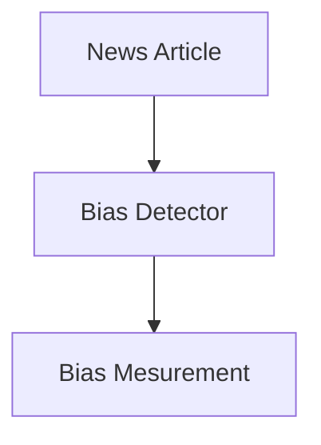

### Design Level 1

```mermaid
graph TD;
    User --> Access Bias News Detector Website;
    Access Bias News Detector Website --> Upload a news website's article link;
    Upload a news website's article link --> Scrape text from article link;
    Scrape text from article link --> Determine Bias Rating of the Article;
```
