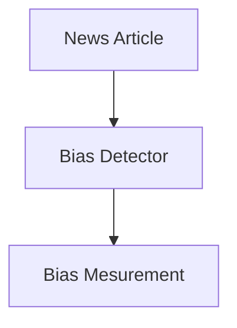
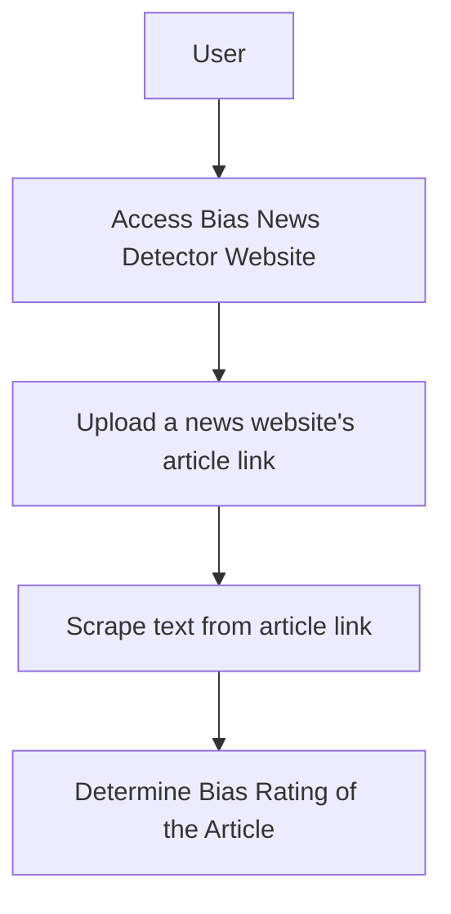

```mermaid
    flowchart TD
        A[News Article] --> B
        B[Bias Detector] --> C
        C[Bias Mesurement]
```

### Design Level 1

```mermaid
graph TD;
    A[User] --> B
    B[Access Bias News Detector Website] --> C
    C[Upload a news website's article link] --> D
    D[Scrape text from article link] --> E
E[Determine Bias Rating of the Article]
```
