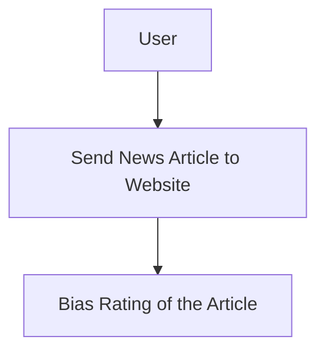
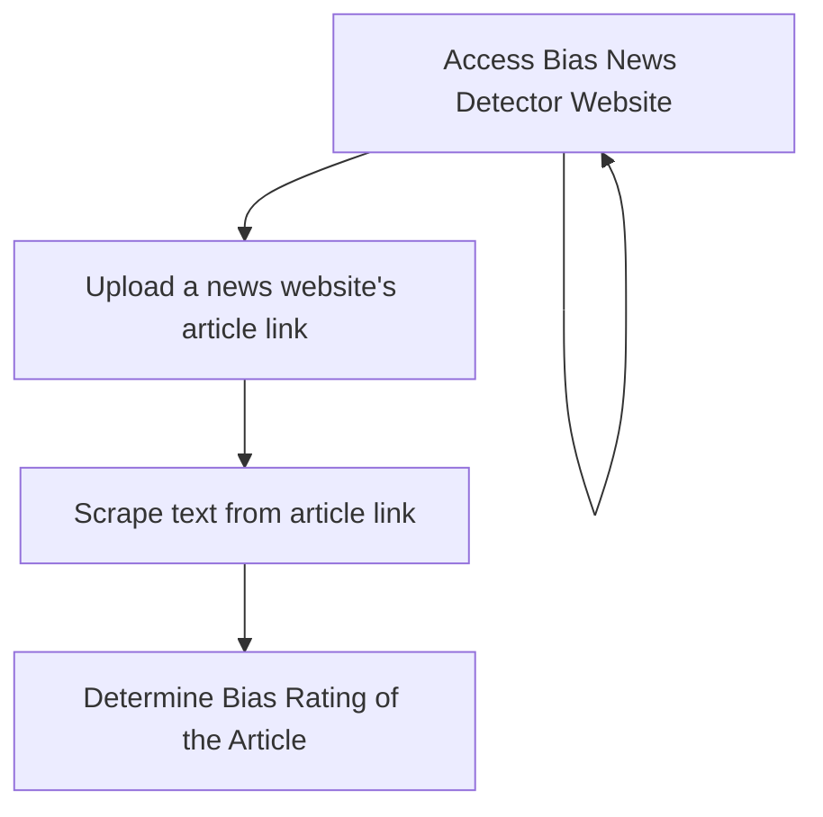

### Design Level 0

```mermaid
graph TD;
    A[User] --> B
    B[Send News Article to Website] --> C
    C[Bias Rating of the Article]
```

### Design Level 1

```mermaid
graph TD;
    D[User] --> D
    D[Access Bias News Detector Website] --> E
    E[Upload a news website's article link] --> F
    F[Scrape text from article link] --> G
    G[Determine Bias Rating of the Article]
```
