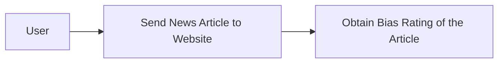
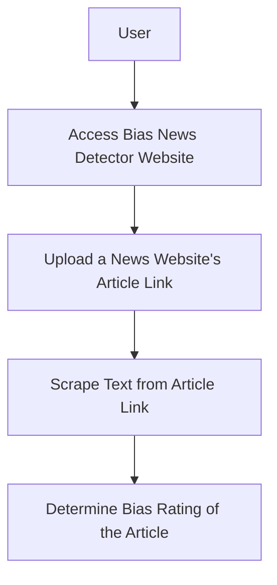

# Part 2

### Design Level 0



### Design Level 1



### Design Level 2

```mermaid
graph TD;
    A[User] --> B;
    B[Access Bias News Detector Website] --> C;
    C[Upload a News Website's Article Link] --> D;
    D[Scrape Text from Article Link] --> E;
    E[Use Natural Language Processing to Find Bias Words] --> F;
    F[Measure Bias Score Based on the Context, Author, Information Given, etc.] -->G;
    G[Reveal Bias Metric to User with Highlighted Section(s) of Article Where it was Bias];
```
