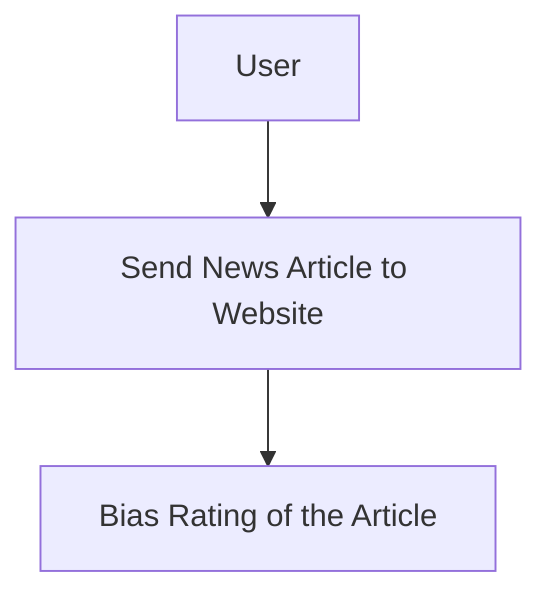
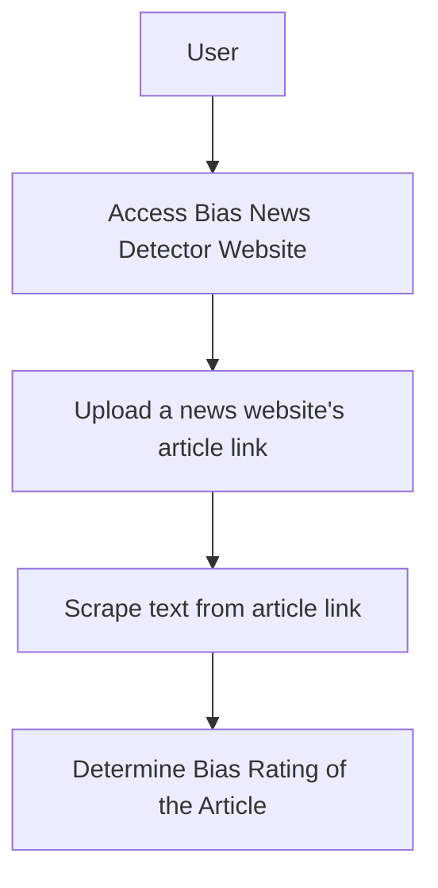

### Design Level 0

```mermaid
graph TD;
    A[User] --> B;
    B[Send News Article to Website] --> C;
    C[Bias Rating of the Article];
```

### Design Level 1

```mermaid
graph TD;
    A[User] --> B
    B[Access Bias News Detector Website] --> C
    C[Upload a news website's article link] --> D
    D[Scrape text from article link] --> E
    E[Determine Bias Rating of the Article]
```

### Design Level 2

```mermaid
graph TD;
    A[User] --> B;
    B[Access Bias News Detector Website] --> C;
    C[Upload a news website's article link] --> D;
    D[Scrape text from article link] --> E;
    E[Determine Bias Rating of the Article];
```
